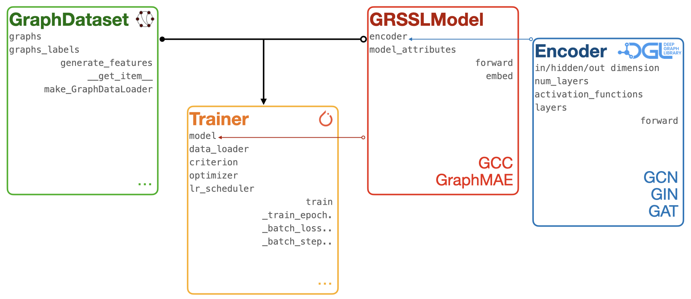
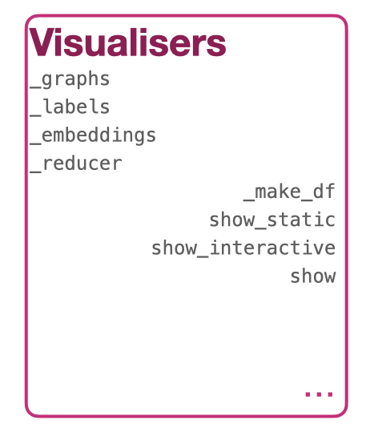
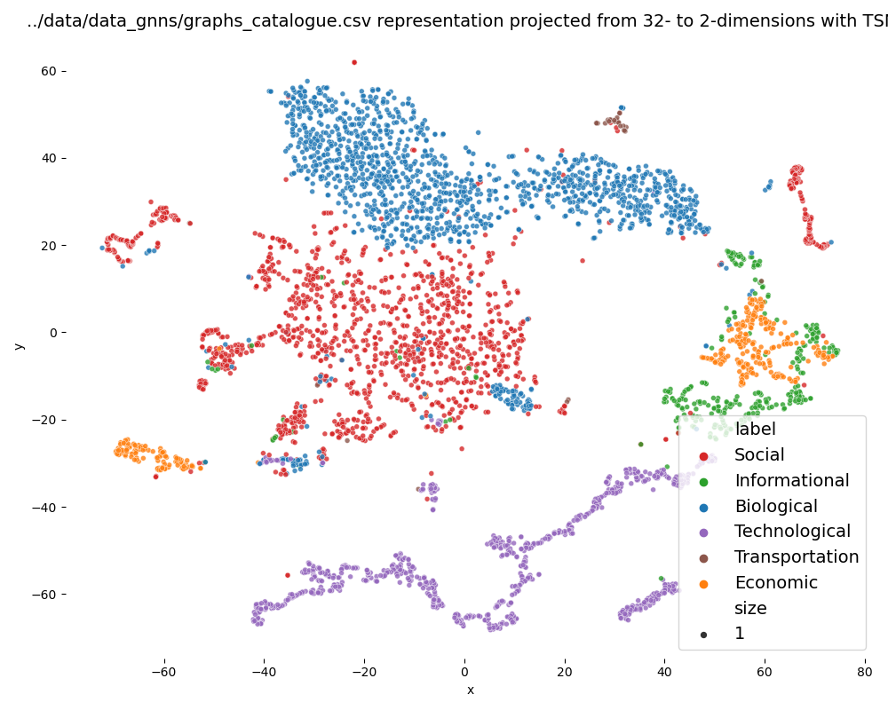
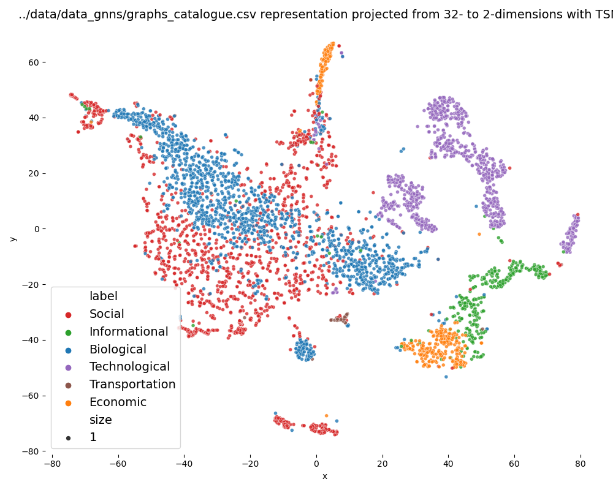
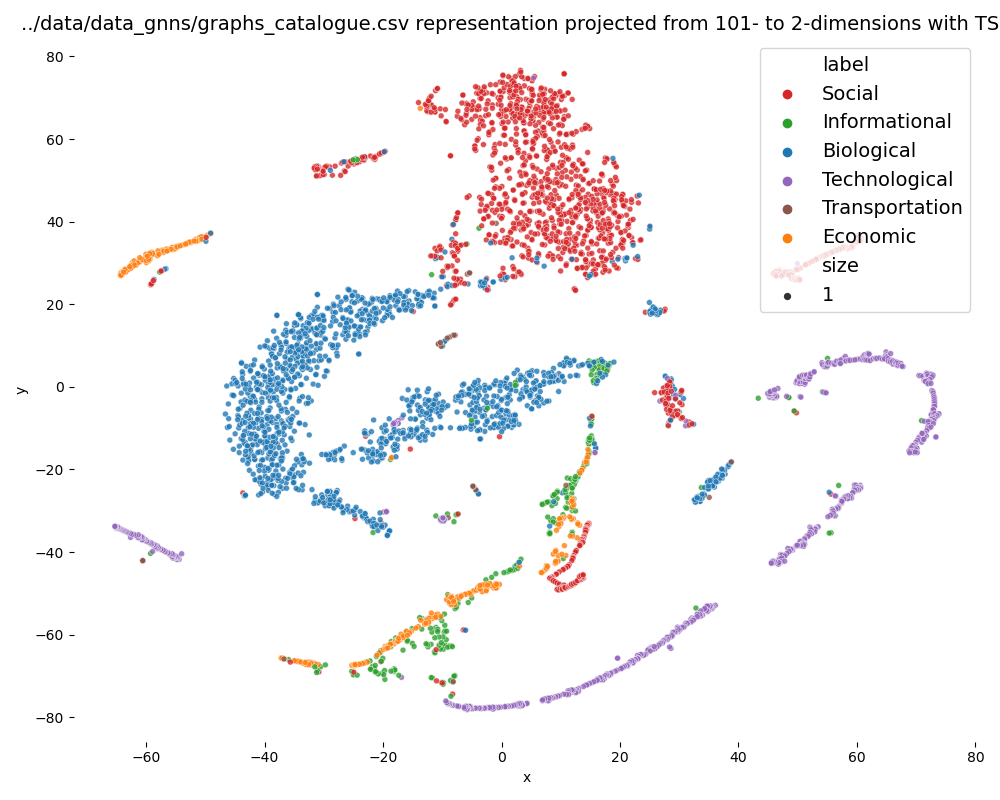
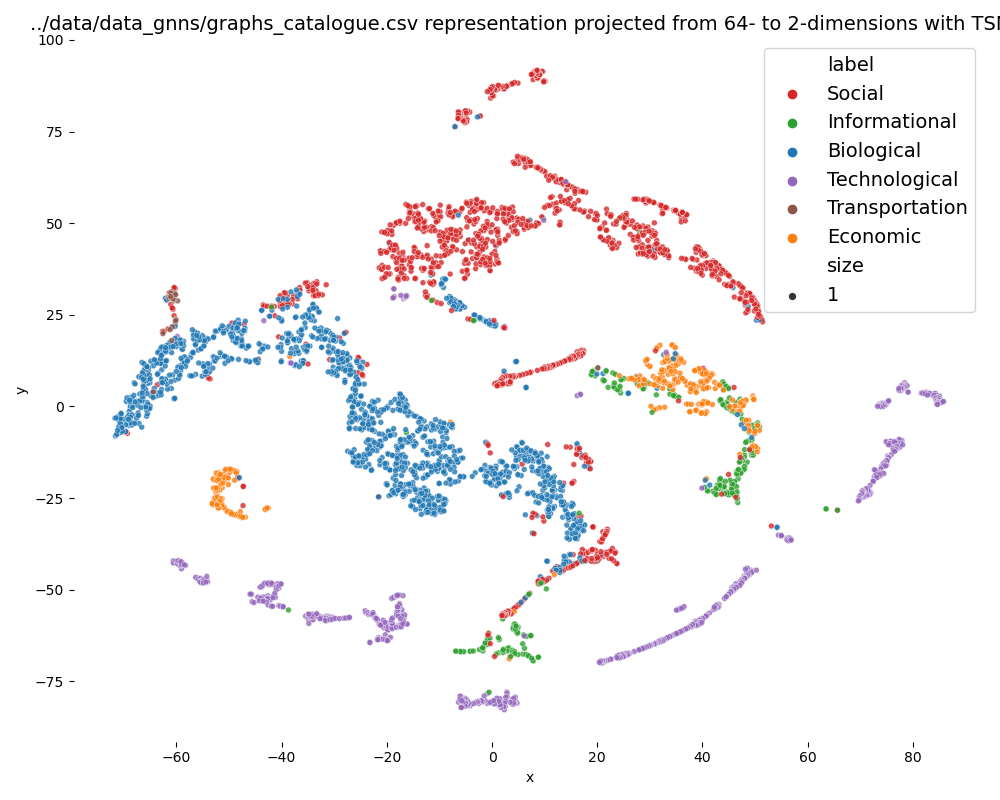
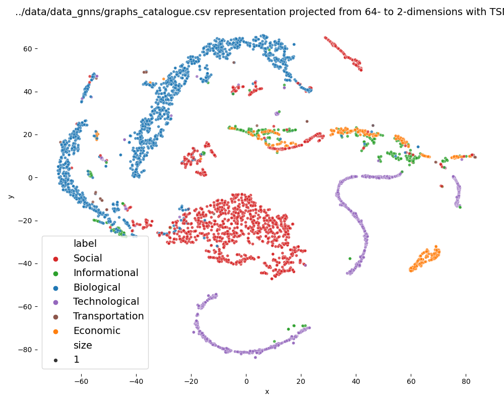
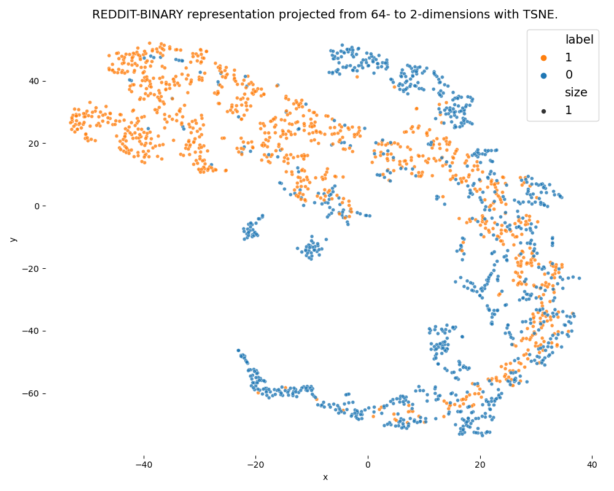
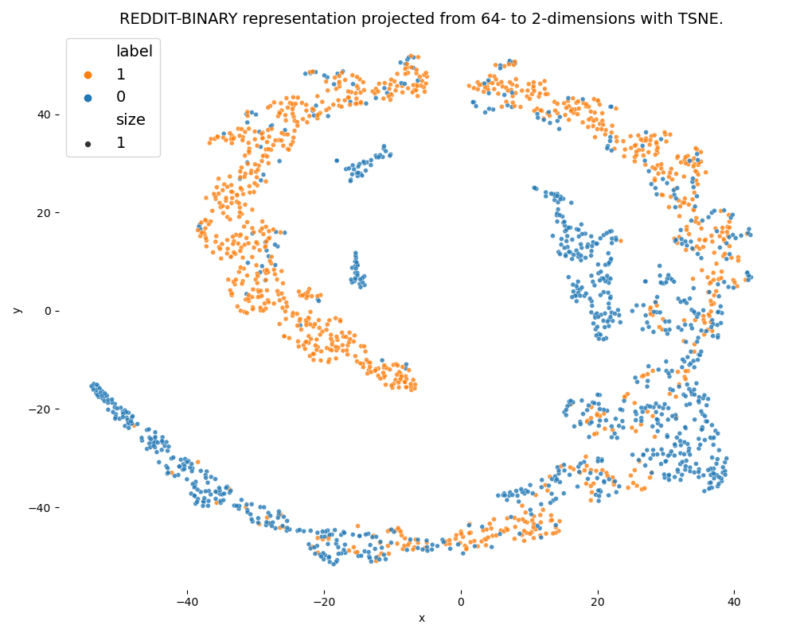

# 📦 Deep Learning Module<a class="anchor" id="top"></a>


This repository aims at hosting the Deep Learning modules to train **Graph Representation Self-Supervised Learning (GRSSL)** methods in order to compute graphs embeddings.

The general deep learning modules rely on PyTorch [[3]](#bib_pytorch)<a class="anchor" id="ref_pytorch_1"></a> and DGL [[4]](#bib_dgl)<a class="anchor" id="ref_dgl_1"></a> libraries.

Data used to (pre)train the graph representation methods come from [Netzschleuder](https://networks.skewed.de/), hosted in graph-tool python library [[5]](#bib_graphtool)<a class="anchor" id="ref_graphtool_1"></a>.

<blockquote>
<a class="anchor" id="ToC"></a>

**Table of Content**
<!-- TOC depthFrom:2 depthTo:6 withLinks:1 updateOnSave:1 orderedList:1 -->

1. [🪩 Features](#features)
2. [⚡️ Quick start](#quick_start)
	1. [Installation](#installation)
	2. [Train a model](#train-a-model)
3. [🌻 Graph Neural Networks](#gnns)
	1. [Models' architecture](#models_arch)
	2. [Encoding Layers](#encoding_layers)
4. [🧳 Graphs Datasets](#graphs_datasets)
5. [⚙️ Implementation](#implementation)
6. [🫧 Usage](#usage)
	1. [Configurations](#configurations)
	2. [Results](#results)
	3. [Visualisation](#visualisation)
7. [🌵 Folder Structure](#folder_structure)
8. [📚 References](#references)
	1. [Bibliography](#bibliography)
	2. [Acknoledgements](#acknoledgements)

<!-- /TOC -->
</blockquote>

The [Graph Neural Networks](#gnns) section wraps the theoretical grounding of the methods whose implementations are hosted in this repository. Details regarding the [Graphs Datasets](#graphs_datasets) used and the [Implementation](#implementation) are described afterwards.
Detailed instructions on how to use the code and/or custom it to ones needs are given in the [Usage](#usage) section.

## 🪩 0. Features <a class="anchor" id="features"></a>

This repository can be used to:
- train GRL models;
- evaluate performances of the models on selected tasks;
- visualise the embeddings produced by the models.

## ⚡️ 1. Quick start <a class="anchor" id="quick_start"></a>

### 1.a Installation

```shell
pip install -r requirements.txt
conda install graph-tool
```

### 1.b Train a model

```shell
python train.py --c <config_file_path>.json
```

You can then visualise the learnt graphs representations with:
```shell
python viz.py --c <config_file_path>.json --n
```

> **Note**
> You can also launch the [companion notebook 🔗](./pipeline.ipynb) for a step-by-step tutorial.


---
## <a class="anchor" id="gnns"></a> 🌻 2. Graph Neural Networks
<p align="right"><a href="#top">🔝</a></p>


### <a class="anchor" id="models_arch"></a> 2.a Self-Supervised models

Self-supervised learning is an attractive training paradigm in the big data era. It aims at mitigating the over-dependence of DL models on labeled data by devising training procedure from pretext tasks that don't require labels.


This repository shelters the implementation of two state-of-the-art self-supervised GRL models: GraphMAE [[1]](#bib_graphmae)<a class="anchor" id="ref_graphmae_2"></a> and PGCL [[2]](#bib_pgcl)<a class="anchor" id="ref_pgcl_2"></a>.
These two models stem the two main subdomain of SSL: predictive and contrastive learning.

On one hand, Graph Masked Auto-Encoder (GraphMAE) is a generative method that aims at reconstructing node features (which are hidden during training).

On the other hand, Prototypical Graph Contrastive Learning (PGCL) is a contrastive learning model that was notably devised to alleviate the *sampling bias* harming contrastive methods.

### <a class="anchor" id="encoding_layers"></a> 2.b Encoding Layers

Most of GRL models (including GraphMAE and PGCL) rely on Graph Neural Networks (GNNs): adaptation of neural networks to handle graph-structured data. GNN layers are the backbone of these models and can often be used interchangeably.

GNNs implement message-passing methods that iteratively aggregate and combine information of nodes and their neighbours. They ultimately produce graphs of nodes' states with the same topology as the input graph.

Three of the most popular GNN instances are:
- Graph Attention layer (GAT)
- Graph Convolutional Network (GCN)
- Graph Isomorphism Network (GIN)

Then, a pooling layer can be used to obtain whole-graph representation from the nodes states.

## 🧳 3. Graphs Datasets<a class="anchor" id="graphs_datasets"></a>
<p align="right"><a href="#top">🔝</a></p>

The main goal of this repository is to enable the implementation of self-supervised methods. Those are meant to be general enough to tackle various tasks, while still being achieving high-performances.

With this in mind, a dataset containing graph from various domains and with different sizes is designed to train the models. Then the models are evaluated on standard graph classification baselines.

### 3.a Training

The training dataset is based on the Netzschleuder catalogue that references graphs hosted by `graph-tool` library [[5]](#bib_graphtool)<a class="anchor" id="ref_graphtool_3_a"></a>.
The training dataset is obtained by setting a few constraints on the types of graphs (number of edges, balance, etc.). Thanks to `graph-tool` implementation, it can easily be loaded within python pipelines and used to train the models.

### 3.b Evaluation

The evaluation of the trained models is performed on the most common benchmark in the literature: graph classification on a subset of datasets from the TUDataset [[6]](#bib_tudataset)<a class="anchor" id="ref_tudataset_3_b"></a>.

## ⚙️ 4. Implementation <a class="anchor" id="implementation"></a>
<p align="right"><a href="#top">🔝</a></p>



The proposed implementation is flexible and provides ways to implement new models based on general modules.
The implementation of the Deep Learning pipeline is composed of 4 main components meant to be customisable and adaptable to fit different frameworks. Each of the module can be modified or instanciated differently to render different models.

These four components allow to load graphs datasets, implement models and their backbone encoders and to train the models:
- `GraphDataset` (see [code](./DataLoader/data_loader.py))
- `GRSSLModel` (see [code](./Models/model_grssl.py))
  - `Encoder` (see [code](./Models/encoders.py))
- `Trainer` (see [code](./Trainers/trainer.py))

## 🫧 5. Usage <a class="anchor" id="usage"></a>
<p align="right"><a href="#top">🔝</a></p>

The whole pipeline is illustrated in [a notebook](./pipe_tests.ipynb) chaining the different steps of this project.

Models can be trained using the following command line:
```shell
python train.py --c <config_file_path>.json
```

The training and results can be replicated by running the `.sh` script:

```bash
./repro_training.sh <config_file>
```

This script will train 5 models instantiated from the same configuration file but with different seeds. The models are stored before training as `model_untrained.pth` and the models from the epoch achieving the lowest loss as `model_best.pth`.

Then the performances of each of the 5 models are assessed (both before and after training) on a selected set of TU Datasets. The results are stored in a `.csv` file, together with the models.


### <a class="anchor" id="configurations"></a>5.a Configurations
<p align="right"><a href="#usage">🫧</a></p>

The configurations of the models are provided as `.json` files containing all the required parameters and hyperparameters from the loading of the training dataset to the model's architectures details and the training scheme to follow.

See example configuration files in [this folder 🔗](./Configs/config_files/).


### <a class="anchor" id="results"></a> 5.b Results
<p align="right"><a href="#usage">🫧</a></p>

Results obtained through this pipeline are described below.

#### <a class="anchor" id="runtimes"></a> Expected runtimes

First note that all computation were undertaken on a MacBook Pro (M1, 2020).

The expected runtimes for the training are shown in the following table:

|Model type|Configuration|Average training time|Av. epoch time|
|:---|:---:|---:|---:|
|GraphMAE|[config link](./Configs/config_files/config_graphmae_repro.json)|02:23:14|00:01:54|
|PGCL| [config link](./Configs/config_files/config_pgcl_repro.json) |07:01:16|00:04:49|

#### <a class="anchor" id="performances"></a> Classification performances

The performances of the models are assessed on several graphs datasets selected from the TU datasets. Those datasets are widely used in the literature and provide common basis for models' comparison.
The performances are computed by appending a SVC-classifier on top of the representations computed by the different models.

The outcome of the performance assessment are compiled in the table below. The average micro-F1 score upon 10-fold classification is reported for each dataset and each of the models.

<details><summary>Instructions to run tests</summary><br/>

The evaluation procedure is implemented in [`Utils/performance_assessment.py`](./Utils/performance_assessment.py). It can be run with the following command line:

```shell
python Utils/performance_assessment.py\
   -s <PATH_TO_SAVED_MODEL_FOLDER>\
	 -r <RUN_ID_0> <RUN_ID_1> ...\ # several possible
	 -d <DATASET_0> <DATASET_1> ...\
```
This script will store the results in a `.csv` file at the level of `<PATH_TO_SAVED_MODEL_FOLDER>`.

</details>

|Model (config)|Custom (Training)|REDDIT-BINARY|COLLAB|IMDB-BINARY|IMDB-MULTI|PROTEINS|DD|
|:---|---:|---:|---:|---:|---:|---:|---:|
|NodesEdges <br>[[ config ]](./saved/best_models/dummiest/)|84 (&plusmn;1) |83 (&plusmn;3)|68 (&plusmn;2)|71 (&plusmn;2)|48 (&plusmn;4)|73 (&plusmn;4)|*75 (&plusmn;4)*|
|TradDegs <br>[[ config ]](./saved/best_models/trad_degs/config.json)|91.9 (&plusmn;1.4)|82.7 (&plusmn;2.4)|**80.8 (&plusmn;1.0)**|*73.1 (&plusmn;3.0)*|*50.5 (&plusmn;1.7)*|**74.9 (&plusmn;3.4)**|*75.8 (&plusmn;3.0)*|
|GraphMAE <br>[[ config ]](./Configs/config_files/config_graphmae_repro.json)|*94.8 (&plusmn;0.3)*|*90.0 (&plusmn;0.5)*|*79.1 (&plusmn;0.4)*|**73.3 (&plusmn;1.0)**|**50.5 (&plusmn;0.4)**|*74.3 (&plusmn;0.8)*|**75.8 (&plusmn;0.4)**|
|PGCL <br>[[ config ]](./Configs/config_files/config_pgcl_repro.json)|**95.1 (&plusmn;1.7)**|**91.4 (&plusmn;0.7)**|74.5 (&plusmn;0.7)|71.3 (&plusmn;0.6)|48.6 (&plusmn;0.8)|70.5 (&plusmn;0.9)|69.8 (&plusmn;1.5)|


<details><summary>Compare with performances BEFORE training</summary>

|Model (config)|Custom (Training)|REDDIT-BINARY|COLLAB|IMDB-BINARY|IMDB-MULTI|PROTEINS|DD|
|:---|---:|---:|---:|---:|---:|---:|---:|
|GraphMAE <br>[[ config ]](./Configs/config_files/config_graphmae_repro.json)<br>Relative Change|94.0 (&plusmn;0.2)<br> ↓ <br>- 0.8%|87.6 (&plusmn;0.3)<br> ↓ <br>- 2.7%|78.2 (&plusmn;0.3)<br> ↓ <br>- 1.7%|73.0 (&plusmn;1.0)<br> = <br>- 0.4%|50.5 (&plusmn;0.6)<br> = <br>+ 0.1%|74.0 (&plusmn;0.7)<br> = <br>- 0.4%|76.2 (&plusmn;0.6)<br> = <br>+ 0.5%|
|PGCL <br>[[ config ]](./Configs/config_files/config_pgcl_repro.json)<br>Relative Change|95.0 (&plusmn;0.7)<br> = <br>- 0.1%|89.5 (&plusmn;1.3) <br> ↓ <br> -2.1% | 69.8 (&plusmn;0.3) <br> ↓ <br> -6.3% | 71.1 (&plusmn;0.4) <br> ↓ <br> -0.3% | 48.1 (&plusmn;0.3) <br> = <br> -1.0% | 69.7 (&plusmn;0.5) <br> = <br> -1.1% | 66.1 (&plusmn;0.8) <br> ↓ <br> -5.3%|

</details>

<!--
<details><summary> Embedding Time</summary>

The table below reports the time taken by the different models to get the representations of all graphs of the datasets:

|Model (config)|Custom (Training)|REDDIT-BINARY|COLLAB|IMDB-BINARY|IMDB-MULTI|PROTEINS|DD|
|:---|---:|---:|---:|---:|---:|---:|---:|
|NodesEdges <br>[[ config ]](./saved/best_models/dummiest/)|00:00:00|00:00:00|00:00:00|00:00:00|00:00:00|00:00:00|00:00:00|
|TradDegs <br>(link degs)|00:00:30|00:00:00|00:00:00|00:00:00|00:00:00|00:00:00|00:00:00|
|GraphMAE <br>[[ config ]](./Configs/config_files/config_graphmae_repro.json)|00:00:00|00:00:00|00:00:00|00:00:00|00:00:00|00:00:00|00:00:00|
|PGCL <br>[[ config ]](./Configs/config_files/config_pgcl_repro.json)|00:00:00|00:00:00|00:00:00|00:00:00|00:00:00|00:00:00|00:00:00|

</details>
-->

<!-- ⚠️ Previous Version
<details><summary> Previous table </summary>


|Model (config)|Custom (Training)|REDDIT-BINARY|COLLAB|IMDB-BINARY|IMDB-MULTI|PROTEINS|DD|
|:---|---:|---:|---:|---:|---:|---:|---:|
|TradFull <br>(link trad)|00.00 |82 (&plusmn;4)|00.00|00.00|00.00|00.00|00.00|00.00|
|NodesEdges <br>[[config]](./saved/best_models/dummiest/)|84 (&plusmn;1) |83 (&plusmn;3)|68 (&plusmn;2)|71 (&plusmn;2)|48 (&plusmn;4)|**73 (&plusmn;4)**|**75 (&plusmn;4)**|
|TradDegs <br>(link degs)|93 (&plusmn;2)|83 (&plusmn;3)|75 (&plusmn;2)|**72 (&plusmn;3)**|49 (&plusmn;3)|71 (&plusmn;6)|73 (&plusmn;4)|
|GraphMAE-vGAT <br>(link GAT)|00 (&plusmn;0)|00 (&plusmn;0)|00 (&plusmn;0)|00 (&plusmn;0)|00 (&plusmn;0)|00 (&plusmn;0)|00 (&plusmn;0)|
|GraphMAE-vGCN <br>(link GCN)|*95 (&plusmn;1)*|*84 (&plusmn;3)*|**76 (&plusmn;2)**|**72 (&plusmn;3)**|**51 (&plusmn;3)**|68 (&plusmn;3)|70 (&plusmn;3)|
|GraphMAE-vGCN-sum <br>(link GCN)|XX (&plusmn;X)|88 (&plusmn;1)|80 (&plusmn;1)|74 (&plusmn;2)|50 (&plusmn;3)|74 (&plusmn;4)|76 (&plusmn;3)|
|GraphMAE-vGIN <br>(link GIN)|93 (&plusmn;1)|78 (&plusmn;3)|**76 (&plusmn;2)**|67 (&plusmn;4)|48 (&plusmn;3)|68 (&plusmn;5)|71 (&plusmn;3)|
|PGCL-default<br>(link PGCL-def)|**96 (&plusmn;1)**|**92 (&plusmn;2)**|74 (&plusmn;2)|71 (&plusmn;3)|48 (&plusmn;3)|70 (&plusmn;4)|67 (&plusmn;2)|
|PGCL-4x16<br>(link PGCL-def)|XX (&plusmn;1)|90 (&plusmn;2)|76 (&plusmn;2)|71 (&plusmn;3)|48 (&plusmn;2)|70 (&plusmn;4)|70 (&plusmn;3)|
|PGCL-4x16-pedges<br>(link PGCL-def)|XX (&plusmn;1)|91 (&plusmn;2)|75 (&plusmn;2)|72 (&plusmn;3)|49 (&plusmn;2)|70 (&plusmn;4)|72 (&plusmn;3)|
|GCC-vGAT<br>(link GAT)|00 (&plusmn;0)|00 (&plusmn;0)|00 (&plusmn;0)|00 (&plusmn;0)|00 (&plusmn;0)|00 (&plusmn;0)|00 (&plusmn;0)|
|GCC-vGCN<br>(link GCN)|00 (&plusmn;0)|00 (&plusmn;0)|00 (&plusmn;0)|00 (&plusmn;0)|00 (&plusmn;0)|00 (&plusmn;0)|00 (&plusmn;0)|
|GCC-vGIN<br>(link GIN)|00 (&plusmn;0)|00 (&plusmn;0)|00 (&plusmn;0)|00 (&plusmn;0)|00 (&plusmn;0)|00 (&plusmn;0)|00 (&plusmn;0)|
</details>
 ⚠️  -->

### <a class="anchor" id="visualisation"></a> 5.c Visualisation
<p align="right"><a href="#usage">🫧</a></p>


The class `GRVisualiser` (see [code](./Visualisers/visualiser.py#L26)) is implemented to ease the visualisation and exploration of Graph Representations computed with the models.

The visualisation module makes use of `matplotlib` [[7]](#bib_matplotlib)<a class="anchor" id="ref_matplotlib_1"></a> and `seaborn` [[8]](#bib_seaborn)<a class="anchor" id="ref_seaborn_1"></a> libraries. The interactive module is implemented with `plotly` [[9]](#bib_plotly)<a class="anchor" id="ref_plotly_1"></a>.

Usage (and possible visualisation outputs) are also showcased in the demonstration notebook.
Visualisations can be obtained by running the following command line:
```shell
python viz.py -m <path_to_model> -d <dataset_name>
```

The following options can be given to the program:
- `-m` or `--model`: the path to the model
- `-d` or `--dataset`: dataset's name
- `-s` or `--save_path`: save figure at this path if given
- `-f` or `--force_save`: save figure with automatically generated name based on `model` and `dataset`, in `illustrations/` folder
- `-i` or `--interactive`: output interactive plot (default at port http://0.0.0.0:8060/)


Then, the program can be executed with the following command line:
```shell
python viz.py -m <model_path> -r <reducer> -d <dataset_id> -f -i
```

For example, the following allows to visualise the embeddings of the `"REDDIT-BINARY"` dataset, generated with the best saved PGCL model (it needs to be saved at `./saved/best_models/PGCL/`), reduced with TSNE; save the figure and output the interactive plot:
```shell
python viz.py -d "REDDIT-BINARY"\
   -m './saved/best_models/PGCL/'\
   -s 'illustrations/pgcl_rdtb_tsne.png'\
   -i
```


<details><summary>Gallery</summary><br/>

<!--
<table>
	<tr>
		<td></td>
		<td>GAT</td>
		<td>GCN</td>
		<td>GIN</td>
	</tr>
	<tr>
		<td>
			GraphMAE
		</td>
    <td>
      
    </td>
    <td>
      
    </td>
    <td>
      
    </td>
  </tr>
	<tr>
		<td>
			GCC
		</td>
    <td>
      
    </td>
    <td>
      
    </td>
    <td>
      
  </tr>
</table>
-->

<table>
	<tr>
		<td></td>
		<td>TradDegs</td>
		<td>PGCL</td>
		<td>GraphMAE</td>
	</tr>
	<tr>
		<td>
			Netzschleuder catalogue
		</td>
    <td>
      
    </td>
    <td>
      
    </td>
    <td>
      
    </td>
  </tr>
	<tr>
		<td>
			REDDIT-BINARY
		</td>
    <td>
      
    </td>
    <td>
      
    </td>
    <td>
      
  </tr>
</table>

</details>

<details><summary>Interactive visualisation demonstration</summary><br/>
GIF of an interactive visualisation (zoom + visualise instances + move + ...)

<p align="center">
	
	</img>
</p>

</details>


## 🌵 6. Folder Structure <a class="anchor" id="folder_structure"></a>
<p align="right"><a href="#top">🔝</a></p>

```shell
DL_module/
├── __init__.py
├── Configs/
│   ├── __init__.py
│   ├── config_files/
│   │   └── <CONFIG_NAME>.json
│   ├── configs_parser.py
│   └── inspector.py # deprecated
├── DataLoader/
│   ├── data_loader.py
│   ├── data_util.py
│   └── test.ipynb # deprecated
├── illustrations/
│   └── ...
├── Logger/
│   ├── __init__.py
│   ├── logger.py
│   ├── logger_config.json
│   └── visualization.py
├── Models/
│   ├── __init__.py
│   ├── encoders.py
│   ├── from_pretrained.py
│   ├── model_grssl.py
│   ├── model_util.py
│   ├── README.md # deprecated ?
│   └── test.ipynb # deprecated
├── PGCL_pipe_tests.ipynb # deprecated
├── pipe_tests.ipynb
├── README.md
├── repro_training.sh
├── requirements.txt
├── saved/
│   ├── best_models/
│   │   ├── <MODEL_NAME>/
│   │   │   ├── config.json
│   │   │   └── model_best.pth
│   │   └── trad_degs/
│   │       └── config.json
│   ├── log/
│   │   └── <MODEL_NAME>/
│   │       └── <RUN_ID>/
│   │           └── info.log
│   ├── models/
│   │   └── <MODEL_NAME>/
│   │       └── <RUN_ID>/
│   │           ├── config.json
│   │           ├── model_untrained.json
│   │           ├── model_best.pth
│   │           └── config.json
│   └── repro/
│       ├── log/
│       │   └── ...
│       └── models/
│           └── ...
├── showcase_pretrained.ipynb
├── tests.ipynb # deprecated
├── train.py
├── Trainers/
│   ├── loss.py
│   ├── trainer.py
│   └── trainer_util.py
├── Utils/
│   ├── misc.py
│   ├── performance_assessment.py
│   └── tasks.py
├── Visualisers/
│   ├── visualiser.py
│   └── viz_util.py
└── viz.py
```

## 📚 7. References <a class="anchor" id="references"></a>
<p align="right"><a href="#top">🔝</a></p>

### Bibliography

<a class="anchor" id="bib_graphmae"></a> [1] (^back to: [<sup>0.</sup>](#ref_graphmae_1); [<sup>2.a</sup>](#ref_graphmae_2)) [ [paper](https://arxiv.org/abs/2205.10803) | [code](https://github.com/THUDM/GraphMAE) ] <br> Hou, Z., Liu, X., Dong, Y., Wang, C., & Tang, J. (2022). GraphMAE: Self-Supervised Masked Graph Autoencoders. arXiv *preprint arXiv:2205.10803*.

<a class="anchor" id="bib_pgcl"></a> [2] (^back to: [<sup>0.</sup>](#ref_pgcl_1); [<sup>2.a</sup>](#ref_pgcl_2)) [ [paper](https://arxiv.org/pdf/2106.09645) | [code](https://github.com/ha-lins/PGCL) ]
Lin, S., Liu, C., Zhou, P., Hu, Z. Y., Wang, S., Zhao, R., ... & Liang, X. (2022). Prototypical Graph Contrastive Learning. *IEEE Transactions on Neural Networks and Learning Systems*.

<!--
<a class="anchor" id="bib_gcc"></a> [2] (^back to: [<sup>0.</sup>](#ref_gcc_1); [<sup>2.a</sup>](#ref_gcc_2)) [ [paper](https://dl.acm.org/doi/abs/10.1145/3394486.3403168) | [code](https://github.com/THUDM/GCC) ] <br> Qiu, J., Chen, Q., Dong, Y., Zhang, J., Yang, H., Ding, M., ... & Tang, J. (2020, August). Gcc: Graph contrastive coding for graph neural network pre-training. In *Proceedings of the 26th ACM SIGKDD International Conference on Knowledge Discovery & Data Mining* (pp. 1150-1160).
-->

<a class="anchor" id="bib_pytorch"></a> [3] (^back to: [<sup>1</sup>](#ref_pytorch_1)) [ [paper](http://papers.neurips.cc/paper/9015-pytorch-an-imperative-style-high-performance-deep-learning-library.pdf) | [code](https://github.com/pytorch/pytorch)] <br> Paszke, A., Gross, S., Massa, F., Lerer, A., Bradbury, J., Chanan, G., … Chintala, S. (2019). PyTorch: An Imperative Style, High-Performance Deep Learning Library. In *Advances in Neural Information Processing Systems 32* (pp. 8024–8035). Curran Associates, Inc.

<a class="anchor" id="bib_dgl"></a> [4] (^back to: [<sup>1</sup>](#ref_dgl_1)) [ [paper](https://arxiv.org/abs/1909.01315) | [code](https://github.com/dmlc/dgl) ] <br> Minjie Wang, Da Zheng, Zihao Ye, Quan Gan, Mufei Li, Xiang Song, Jinjing Zhou, Chao Ma, Lingfan Yu, Yu Gai, Tianjun Xiao, Tong He, George Karypis, Jinyang Li, & Zheng Zhang (2019). Deep Graph Library: A Graph-Centric, Highly-Performant Package for Graph Neural Networks. arXiv *preprint arXiv:1909.01315*.

<a class="anchor" id="bib_graphtool"></a>[5] (^back to: [<sup>1</sup>](#ref_graphtool_1), [<sup>3.a</sup>](#ref_graphtool_3_a)) [ [website](https://graph-tool.skewed.de) | [figshare](https://figshare.com/articles/dataset/graph_tool/1164194) ] <br> Tiago P. Peixoto. (2014). The graph-tool python library. *figshare*.

<a class="anchor" id="bib_tudataset"></a>[6] (^back to: [<sup>3.b</sup>](#ref_tudataset_3_b)) [ [website](https://chrsmrrs.github.io/datasets/) | [paper](https://grlplus.github.io/papers/79.pdf) ] <br> Christopher Morris, Nils M. Kriege, Franka Bause, Kristian Kersting, Petra Mutzel, & Marion Neumann (2020). TUDataset: A collection of benchmark datasets for learning with graphs. In *ICML 2020 Workshop on Graph Representation Learning and Beyond (GRL+ 2020)*.


<a class="anchor" id="bib_matplotlib"></a>[7] (^back to: [<sup>5.c</sup>](#ref_matplotlib_1)) [ [website](https://matplotlib.org/stable/index.html) ] <br> Hunter, J. (2007). Matplotlib: A 2D graphics environment. *Computing in Science & Engineering, 9(3), 90–95*.

<a class="anchor" id="bib_seaborn"></a>[8] (^back to: [<sup>5.c</sup>](#ref_seaborn_1)) [ [website](https://seaborn.pydata.org/index.html) ] <br> Michael L. Waskom (2021). seaborn: statistical data visualization. *Journal of Open Source Software, 6(60), 3021*.

<a class="anchor" id="bib_plotly"></a>[9] (^back to: [<sup>5.c</sup>](#ref_plotly_1)) [ [website](https://plotly.com) ] <br> Inc., P. T. (2015). Collaborative data science. Montreal, QC: Plotly Technologies Inc. *Retrieved from https://plot.ly*.


### Acknoledgements

- The general organisation of this repository, as well as some general implementations are taken from the project [`pytorch-template`](https://github.com/victoresque/pytorch-template).

- The code of the different GRSSL methods are slight adjustments of the original implementations to fit the general framework used here.

---
<p align="center">
[ <a href="#features">🪩</a> | <a href="#quick_start">⚡️</a> | <a href="#gnns">🌻</a> | <a href="#graphs_datasets">🧳</a> | <a href="#implementation">⚙️</a> | <a href="#usage">🫧</a> | <a href="#folder_structure">🌵</a> | <a href="#references">📚</a> ]
</p>
