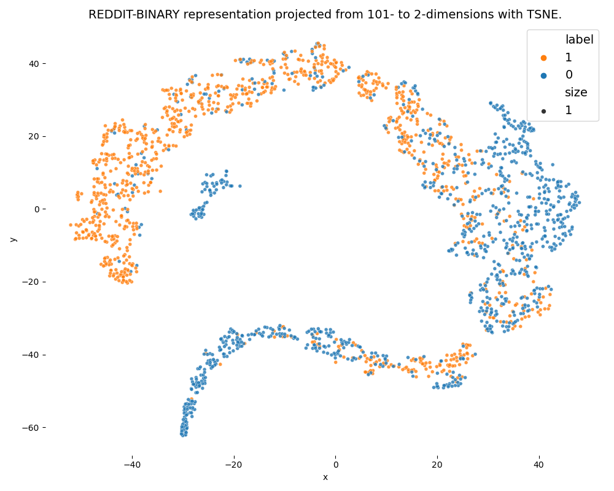

# 📦 Deep Learning Module<a class="anchor" id="top"></a>

[](https://nbviewer.org) [![badge](https://img.shields.io/badge/launch-binder-579aca.svg?logo=data:image/png;base64,iVBORw0KGgoAAAANSUhEUgAAAFkAAABZCAMAAABi1XidAAAB8lBMVEX///9XmsrmZYH1olJXmsr1olJXmsrmZYH1olJXmsr1olJXmsrmZYH1olL1olJXmsr1olJXmsrmZYH1olL1olJXmsrmZYH1olJXmsr1olL1olJXmsrmZYH1olL1olJXmsrmZYH1olL1olL0nFf1olJXmsrmZYH1olJXmsq8dZb1olJXmsrmZYH1olJXmspXmspXmsr1olL1olJXmsrmZYH1olJXmsr1olL1olJXmsrmZYH1olL1olLeaIVXmsrmZYH1olL1olL1olJXmsrmZYH1olLna31Xmsr1olJXmsr1olJXmsrmZYH1olLqoVr1olJXmsr1olJXmsrmZYH1olL1olKkfaPobXvviGabgadXmsqThKuofKHmZ4Dobnr1olJXmsr1olJXmspXmsr1olJXmsrfZ4TuhWn1olL1olJXmsqBi7X1olJXmspZmslbmMhbmsdemsVfl8ZgmsNim8Jpk8F0m7R4m7F5nLB6jbh7jbiDirOEibOGnKaMhq+PnaCVg6qWg6qegKaff6WhnpKofKGtnomxeZy3noG6dZi+n3vCcpPDcpPGn3bLb4/Mb47UbIrVa4rYoGjdaIbeaIXhoWHmZYHobXvpcHjqdHXreHLroVrsfG/uhGnuh2bwj2Hxk17yl1vzmljzm1j0nlX1olL3AJXWAAAAbXRSTlMAEBAQHx8gICAuLjAwMDw9PUBAQEpQUFBXV1hgYGBkcHBwcXl8gICAgoiIkJCQlJicnJ2goKCmqK+wsLC4usDAwMjP0NDQ1NbW3Nzg4ODi5+3v8PDw8/T09PX29vb39/f5+fr7+/z8/Pz9/v7+zczCxgAABC5JREFUeAHN1ul3k0UUBvCb1CTVpmpaitAGSLSpSuKCLWpbTKNJFGlcSMAFF63iUmRccNG6gLbuxkXU66JAUef/9LSpmXnyLr3T5AO/rzl5zj137p136BISy44fKJXuGN/d19PUfYeO67Znqtf2KH33Id1psXoFdW30sPZ1sMvs2D060AHqws4FHeJojLZqnw53cmfvg+XR8mC0OEjuxrXEkX5ydeVJLVIlV0e10PXk5k7dYeHu7Cj1j+49uKg7uLU61tGLw1lq27ugQYlclHC4bgv7VQ+TAyj5Zc/UjsPvs1sd5cWryWObtvWT2EPa4rtnWW3JkpjggEpbOsPr7F7EyNewtpBIslA7p43HCsnwooXTEc3UmPmCNn5lrqTJxy6nRmcavGZVt/3Da2pD5NHvsOHJCrdc1G2r3DITpU7yic7w/7Rxnjc0kt5GC4djiv2Sz3Fb2iEZg41/ddsFDoyuYrIkmFehz0HR2thPgQqMyQYb2OtB0WxsZ3BeG3+wpRb1vzl2UYBog8FfGhttFKjtAclnZYrRo9ryG9uG/FZQU4AEg8ZE9LjGMzTmqKXPLnlWVnIlQQTvxJf8ip7VgjZjyVPrjw1te5otM7RmP7xm+sK2Gv9I8Gi++BRbEkR9EBw8zRUcKxwp73xkaLiqQb+kGduJTNHG72zcW9LoJgqQxpP3/Tj//c3yB0tqzaml05/+orHLksVO+95kX7/7qgJvnjlrfr2Ggsyx0eoy9uPzN5SPd86aXggOsEKW2Prz7du3VID3/tzs/sSRs2w7ovVHKtjrX2pd7ZMlTxAYfBAL9jiDwfLkq55Tm7ifhMlTGPyCAs7RFRhn47JnlcB9RM5T97ASuZXIcVNuUDIndpDbdsfrqsOppeXl5Y+XVKdjFCTh+zGaVuj0d9zy05PPK3QzBamxdwtTCrzyg/2Rvf2EstUjordGwa/kx9mSJLr8mLLtCW8HHGJc2R5hS219IiF6PnTusOqcMl57gm0Z8kanKMAQg0qSyuZfn7zItsbGyO9QlnxY0eCuD1XL2ys/MsrQhltE7Ug0uFOzufJFE2PxBo/YAx8XPPdDwWN0MrDRYIZF0mSMKCNHgaIVFoBbNoLJ7tEQDKxGF0kcLQimojCZopv0OkNOyWCCg9XMVAi7ARJzQdM2QUh0gmBozjc3Skg6dSBRqDGYSUOu66Zg+I2fNZs/M3/f/Grl/XnyF1Gw3VKCez0PN5IUfFLqvgUN4C0qNqYs5YhPL+aVZYDE4IpUk57oSFnJm4FyCqqOE0jhY2SMyLFoo56zyo6becOS5UVDdj7Vih0zp+tcMhwRpBeLyqtIjlJKAIZSbI8SGSF3k0pA3mR5tHuwPFoa7N7reoq2bqCsAk1HqCu5uvI1n6JuRXI+S1Mco54YmYTwcn6Aeic+kssXi8XpXC4V3t7/ADuTNKaQJdScAAAAAElFTkSuQmCC)](https://mybinder.org) [](https://www.google.com/url?sa=t&rct=j&q=&esrc=s&source=web&cd=&ved=2ahUKEwjf9arI8uT7AhXqR_EDHVXdCvsQFnoECBEQAQ&url=https%3A%2F%2Fcolab.research.google.com%2F&usg=AOvVaw3A5aPK2kLFzKOzb6sOckVw)


This repository aims at hosting the Deep Learning modules to train **Graph Representation Self-Supervised Learning (GRSSL)** methods in order to compute graphs embeddings.

The general deep learning modules rely on PyTorch [[3]](#bib_pytorch)<a class="anchor" id="ref_pytorch_1"></a> and DGL [[4]](#bib_dgl)<a class="anchor" id="ref_dgl_1"></a> libraries.

Data used to (pre)train the graph representation methods come from [Netzschleuder](https://networks.skewed.de/), hosted in graph-tool python library [[5]](#bib_graphtool)<a class="anchor" id="ref_graphtool_1"></a>.

<blockquote>
<a class="anchor" id="ToC"></a>

**Table of Content**
<!-- TOC depthFrom:2 depthTo:6 withLinks:1 updateOnSave:1 orderedList:1 -->

1. [🪩 Features](#features)
2. [⚡️ Quick start](#quick_start)
	1. [Installation](#installation)
	2. [Train a model](#train-a-model)
3. [🌻 Graph Neural Networks](#gnns)
	1. [Models' architecture](#models_arch)
	2. [Encoding Layers](#encoding_layers)
4. [🧳 Graphs Datasets](#graphs_datasets)
5. [⚙️ Implementation](#implementation)
6. [🫧 Usage](#usage)
	1. [Configurations](#configurations)
	2. [Results](#results)
	3. [Visualisation](#visualisation)
7. [🌵 Folder Structure](#folder_structure)
8. [📚 References](#references)
	1. [Bibliography](#bibliography)
	2. [Acknoledgements](#acknoledgements)

<!-- /TOC -->
</blockquote>

The [Graph Neural Networks](#gnns) section wraps the theoretical grounding of the methods whose implementations are hosted in this repository. Details regarding the [Graphs Datasets](#graphs_datasets) used and the [Implementation](#implementation) are described afterwards.
Detailed instructions on how to use the code and/or custom it to ones needs are given in the [Usage](#usage) section.

## 🪩 0. Features <a class="anchor" id="features"></a>

- train models
- evaluate performance on selected tasks
- visualise graphs embeddings

## ⚡️ 1. Quick start <a class="anchor" id="quick_start"></a>

### 1.a Installation

XX TODO requirements XX

```shell
pip install -r requirements.txt
```

### 1.b Train a model

```shell
python train.py --c <config_file_path>.json
```

You can then visualise the learnt graphs representations with:
```shell
python viz.py --c <config_file_path>.json --n
```
---
## <a class="anchor" id="gnns"></a> 🌻 2. Graph Neural Networks
<p align="right"><a href="#top">🔝</a></p>

### <a class="anchor" id="models_arch"></a> 2.a Models' architecture

| Method Name | Paradigm | XX | XX |
|:---|:---:|:---:|:---:|
|GraphMAE [[1]](#bib_graphmae)<a class="anchor" id="ref_graphmae_2"></a>|Generative|XX|XX|
|PGCL [[2]](#bib_pgcl)<a class="anchor" id="ref_pgcl_2"></a>|Contrastive|XX|XX|

### <a class="anchor" id="encoding_layers"></a> 2.b Encoding Layers

- Graph Attention layer (GAT)
- Graph Convolutional Network (GCN)
- Graph Isomorphism Network (GIN) [DGL doc](https://docs.dgl.ai/api/python/nn-pytorch.html#conv-layers), [[X]]()

## 🧳 3. Graphs Datasets<a class="anchor" id="graphs_datasets"></a>
<p align="right"><a href="#top">🔝</a></p>

TODO:
 - [ ] explaing the overall setting (self-supervised)
 - [ ] ambitions: agnostic, general enough, still efficient


### 3.a Training

Netzschleuder hosted by `graph-tool` library [[5]](#bib_graphtool)<a class="anchor" id="ref_graphtool_3_a"></a>.

### 3.b Evaluation

TUDataset [[6]](#bib_tudataset)<a class="anchor" id="ref_tudataset_3_b"></a>.

## ⚙️ 4. Implementation <a class="anchor" id="implementation"></a>
<p align="right"><a href="#top">🔝</a></p>


- `GraphDataset` (see [code](./DataLoader/data_loader.py))
- `GRSSLModel` (see [code](./Models/model_grssl.py))
  - `Encoder` (see [code](./Models/encoders.py))
- `Trainer` (see [code](./Trainers/trainer.py))

## 🫧 5. Usage <a class="anchor" id="usage"></a>
<p align="right"><a href="#top">🔝</a></p>

The whole pipeline is illustrated in [a notebook](./pipe_tests.ipynb) chaining the different steps of this project.

Models can be trained using the following command line:
```shell
python train.py --c <config_file_path>.json
```

The training and results can be replicated by running the `.sh` script:

```bash
./repro_training.sh <config_file>
```

This script will train 5 models instantiated from the same configuration file but with different seeds. The models are stored before training as `model_untrained.pth` and the models from the epoch achieving the lowest loss as `model_best.pth`.

Then the performances of each of the 5 models are assessed (both before and after training) on a selected set of TU Datasets. The results are stored in a `.csv` file, together with the models.


### <a class="anchor" id="configurations"></a>5.a Configurations
<p align="right"><a href="#usage">🫧</a></p>

XX Do a ConfigParser card + describe main parameters XX

<details><summary>GraphMAE Configuration</summary><br/>
Specific arguments and parameters

Example:
```yaml
{
    "name": "GraphMAE",
    "n_gpu": 1,
    "seed":0,
    "inspect":false,
    "do_train":true,

    "arch": {
        "type": "GraphMAEModel",
        "args":{
            "encoder_name":"gcn",
            "encoder_args":{
                "num_layers":4,
                "input_dimension":512,
                "output_dimension":64,
                "hidden_dimension":64,
                "activation":"relu",
                "dropout":0.0,
                "layernorm":false
            },
            "decoder_name":"gcn",
            "mask_rate":0.5,
            "drop_edge_rate":0.0
        }
    },
    "dataset": {
        "type": "GraphMAEDataset",
        "args":{
            "dgl_graphs": "../data/data_gnns/graphs_catalogue.csv",
            "verbosity":true,
            "MAX_DEGREES": 511,
            "feature_dim":512,
            "from_csv":true
        }
    },
    "data_loader": {
        "batch_size":64,
        "pin_memory":true,
        "shuffle":false,
        "sampler":"SubsetRandomSampler",
        "collate_fn":"collate_fn_graphmae"
    },
    "optimizer": {
        "type": "Adam",
        "args":{
            "lr": 0.00015,
            "weight_decay": 0.0,
            "amsgrad": true
        }
    },
    "loss": "sce",
    "loss_type":{
        "type":"SCELoss",
        "args":{
            "alpha":3
        }
    },
    "metrics": [
        "accuracy", "top_k_acc"
    ],
    "lr_scheduler": {
        "type": "StepLR",
        "args": {
            "step_size": 50,
            "gamma": 0.1
        }
    },
    "trainer_type":{
        "type":"GraphMAETrainer",
        "args":{
        }
    },
    "trainer": {
        "epochs": 100,

        "save_dir": "saved/repro/",
        "save_period": 0.1,
        "verbosity": 2,

        "monitor": "min loss",
        "early_stop": 10,

        "tensorboard": false
    }
}
```
</details>

<details><summary>PGCL Configuration</summary><br/>
Specific arguments and parameters
</details>

### <a class="anchor" id="results"></a> 5.b Results
<p align="right"><a href="#usage">🫧</a></p>

#### <a class="anchor" id="downloads"></a> Download models ?

#### <a class="anchor" id="runtimes"></a> Expected runtimes

XX Details about the machine XX

|Model type|Configuration|Average training time|Av. epoch time|Av. embedding time|
|:---|:---:|---:|---:|---:|
|GraphMAE|[config link](./Configs/config_files/config_graphmae_repro.json)|02:23:14|00:01:54|00:00:00|
|PGCL|[config link](./Configs/config_files/config_pgcl_repro.json)|07:01:16|00:04:49|00:00:00|

#### <a class="anchor" id="performances"></a> Classification performances

The performances of the models are assessed on several graphs datasets selected from the TU datasets [XX TODO cite XX]. Those datasets are widely used in the literature and provide common basis for models' comparison.
The performances are computed by appending a SVC-classifier [XX TODO cite XX] on top of the representations computed by the different models.

The outcome of the performance assessment are compiled in the table below. The average micro-F1 score upon 10-fold classification is reported for each dataset and each of the models.

<details><summary>Instructions to run tests</summary><br/>
XX TODO UPDATE XX

Detailed instructions to run specific tests and outputs

For example to run tests on a dataset from TUDataset [[6]](#bib_tudataset)<a class="anchor" id="ref_tudataset_1"></a>.

```python
from Utils.tasks import testmodel_classification

tudata_name = "REDDIT-BINARY"

test_classification = testmodel_classification(
   model = "saved/best_models/dummiest/",
   dataset = "REDDIT-BINARY"
)
```

Then, running
```python
test_classification.print_scores()
```
would yield the following:
```
Scores:
	- Micro-F1 = 0.8335
	- Micro-F1 (std.) = 0.0227
	- most_frequent - micro-F1 = 0.5
	- most_frequent - micro-F1 (std.) = 0
	- uniform - micro-F1 = 0.489
	- uniform - micro-F1 (std.) = 0.02142
```

This process can be repeated for several models and datasets. This is implemented in [`Utils/performance_assessment.py`](./Utils/performance_assessment.py). It can directly be run with the following command line:

```shell
python Utils/performance_assessment.py\
   -s <PATH_TO_SAVED_MODEL_FOLDER>\
	 -r <RUN_ID_0> <RUN_ID_1> ...\ # several possible
	 -d <DATASET_0> <DATASET_1> ...\
```
This script will store the results in a `.csv` file at the level of `<PATH_TO_SAVED_MODEL_FOLDER>`.

</details>

|Model (config)|Custom (Training)|REDDIT-BINARY|COLLAB|IMDB-BINARY|IMDB-MULTI|PROTEINS|DD|
|:---|---:|---:|---:|---:|---:|---:|---:|
|NodesEdges <br>[[ config ]](./saved/best_models/dummiest/)|84 (&plusmn;1) |83 (&plusmn;3)|68 (&plusmn;2)|71 (&plusmn;2)|48 (&plusmn;4)|73 (&plusmn;4)|*75 (&plusmn;4)*|
|TradDegs <br>[[ config ]](./saved/best_models/trad_degs/config.json)|91.9 (&plusmn;1.4)|82.7 (&plusmn;2.4)|**80.8 (&plusmn;1.0)**|*73.1 (&plusmn;3.0)*|*50.5 (&plusmn;1.7)*|**74.9 (&plusmn;3.4)**|*75.8 (&plusmn;3.0)*|
|GraphMAE <br>[[ config ]](./Configs/config_files/config_graphmae_repro.json)|*94.8 (&plusmn;0.3)*|*90.0 (&plusmn;0.5)*|*79.1 (&plusmn;0.4)*|**73.3 (&plusmn;1.0)**|**50.5 (&plusmn;0.4)**|*74.3 (&plusmn;0.8)*|**75.8 (&plusmn;0.4)**|
|PGCL <br>[[ config ]](./Configs/config_files/config_pgcl_repro.json)|**95.1 (&plusmn;1.7)**|**91.4 (&plusmn;0.7)**|74.5 (&plusmn;0.7)|71.3 (&plusmn;0.6)|48.6 (&plusmn;0.8)|70.5 (&plusmn;0.9)|69.8 (&plusmn;1.5)|


<details><summary>Compare with performances BEFORE training</summary>

TODO:
- [ ] cf. Reservoir computing etc.

|Model (config)|Custom (Training)|REDDIT-BINARY|COLLAB|IMDB-BINARY|IMDB-MULTI|PROTEINS|DD|
|:---|---:|---:|---:|---:|---:|---:|---:|
|GraphMAE <br>[[ config ]](./Configs/config_files/config_graphmae_repro.json)<br>Relative Change|94.0 (&plusmn;0.2)<br> ↓ <br>- 0.8%|87.6 (&plusmn;0.3)<br> ↓ <br>- 2.7%|78.2 (&plusmn;0.3)<br> ↓ <br>- 1.7%|73.0 (&plusmn;1.0)<br> = <br>- 0.4%|50.5 (&plusmn;0.6)<br> = <br>+ 0.1%|74.0 (&plusmn;0.7)<br> = <br>- 0.4%|76.2 (&plusmn;0.6)<br> = <br>+ 0.5%|
|PGCL <br>[[ config ]](./Configs/config_files/config_pgcl_repro.json)<br>Relative Change|95.0 (&plusmn;0.7)<br> = <br>- 0.1%|89.5 (&plusmn;1.3) <br> ↓ <br> -2.1% | 69.8 (&plusmn;0.3) <br> ↓ <br> -6.3% | 71.1 (&plusmn;0.4) <br> ↓ <br> -0.3% | 48.1 (&plusmn;0.3) <br> = <br> -1.0% | 69.7 (&plusmn;0.5) <br> = <br> -1.1% | 66.1 (&plusmn;0.8) <br> ↓ <br> -5.3%|

</details>

<details><summary> Embedding Time</summary>

The table below reports the time taken by the different models to get the representations of all graphs of the datasets:

|Model (config)|Custom (Training)|REDDIT-BINARY|COLLAB|IMDB-BINARY|IMDB-MULTI|PROTEINS|DD|
|:---|---:|---:|---:|---:|---:|---:|---:|
|NodesEdges <br>[[ config ]](./saved/best_models/dummiest/)|00:00:00|00:00:00|00:00:00|00:00:00|00:00:00|00:00:00|00:00:00|
|TradDegs <br>(link degs)|00:00:30|00:00:00|00:00:00|00:00:00|00:00:00|00:00:00|00:00:00|
|GraphMAE <br>[[ config ]](./Configs/config_files/config_graphmae_repro.json)|00:00:00|00:00:00|00:00:00|00:00:00|00:00:00|00:00:00|00:00:00|
|PGCL <br>[[ config ]](./Configs/config_files/config_pgcl_repro.json)|00:00:00|00:00:00|00:00:00|00:00:00|00:00:00|00:00:00|00:00:00|

</details>

<!-- ⚠️ Previous Version
<details><summary> Previous table </summary>


|Model (config)|Custom (Training)|REDDIT-BINARY|COLLAB|IMDB-BINARY|IMDB-MULTI|PROTEINS|DD|
|:---|---:|---:|---:|---:|---:|---:|---:|
|TradFull <br>(link trad)|00.00 |82 (&plusmn;4)|00.00|00.00|00.00|00.00|00.00|00.00|
|NodesEdges <br>[[config]](./saved/best_models/dummiest/)|84 (&plusmn;1) |83 (&plusmn;3)|68 (&plusmn;2)|71 (&plusmn;2)|48 (&plusmn;4)|**73 (&plusmn;4)**|**75 (&plusmn;4)**|
|TradDegs <br>(link degs)|93 (&plusmn;2)|83 (&plusmn;3)|75 (&plusmn;2)|**72 (&plusmn;3)**|49 (&plusmn;3)|71 (&plusmn;6)|73 (&plusmn;4)|
|GraphMAE-vGAT <br>(link GAT)|00 (&plusmn;0)|00 (&plusmn;0)|00 (&plusmn;0)|00 (&plusmn;0)|00 (&plusmn;0)|00 (&plusmn;0)|00 (&plusmn;0)|
|GraphMAE-vGCN <br>(link GCN)|*95 (&plusmn;1)*|*84 (&plusmn;3)*|**76 (&plusmn;2)**|**72 (&plusmn;3)**|**51 (&plusmn;3)**|68 (&plusmn;3)|70 (&plusmn;3)|
|GraphMAE-vGCN-sum <br>(link GCN)|XX (&plusmn;X)|88 (&plusmn;1)|80 (&plusmn;1)|74 (&plusmn;2)|50 (&plusmn;3)|74 (&plusmn;4)|76 (&plusmn;3)|
|GraphMAE-vGIN <br>(link GIN)|93 (&plusmn;1)|78 (&plusmn;3)|**76 (&plusmn;2)**|67 (&plusmn;4)|48 (&plusmn;3)|68 (&plusmn;5)|71 (&plusmn;3)|
|PGCL-default<br>(link PGCL-def)|**96 (&plusmn;1)**|**92 (&plusmn;2)**|74 (&plusmn;2)|71 (&plusmn;3)|48 (&plusmn;3)|70 (&plusmn;4)|67 (&plusmn;2)|
|PGCL-4x16<br>(link PGCL-def)|XX (&plusmn;1)|90 (&plusmn;2)|76 (&plusmn;2)|71 (&plusmn;3)|48 (&plusmn;2)|70 (&plusmn;4)|70 (&plusmn;3)|
|PGCL-4x16-pedges<br>(link PGCL-def)|XX (&plusmn;1)|91 (&plusmn;2)|75 (&plusmn;2)|72 (&plusmn;3)|49 (&plusmn;2)|70 (&plusmn;4)|72 (&plusmn;3)|
|GCC-vGAT<br>(link GAT)|00 (&plusmn;0)|00 (&plusmn;0)|00 (&plusmn;0)|00 (&plusmn;0)|00 (&plusmn;0)|00 (&plusmn;0)|00 (&plusmn;0)|
|GCC-vGCN<br>(link GCN)|00 (&plusmn;0)|00 (&plusmn;0)|00 (&plusmn;0)|00 (&plusmn;0)|00 (&plusmn;0)|00 (&plusmn;0)|00 (&plusmn;0)|
|GCC-vGIN<br>(link GIN)|00 (&plusmn;0)|00 (&plusmn;0)|00 (&plusmn;0)|00 (&plusmn;0)|00 (&plusmn;0)|00 (&plusmn;0)|00 (&plusmn;0)|
</details>
 ⚠️  -->

### <a class="anchor" id="visualisation"></a> 5.c Visualisation
<p align="right"><a href="#usage">🫧</a></p>


The class `GRVisualiser` (see [code](./Visualisers/visualiser.py#L26)) is implemented to ease the visualisation and exploration of Graph Representations computed with the models.

The visualisation module makes use of `matplotlib` [[7]](#bib_matplotlib)<a class="anchor" id="ref_matplotlib_1"></a> and `seaborn` [[8]](#bib_seaborn)<a class="anchor" id="ref_seaborn_1"></a> libraries. The interactive module is implemented with `plotly` [[9]](#bib_plotly)<a class="anchor" id="ref_plotly_1"></a>.

Usage (and possible visualisation outputs) are also showcased in the demonstration notebook.
Visualisations can be obtained by running the following command line:
```shell
python viz.py -m <path_to_model> -d <dataset_name>
```

The following options can be given to the program:
- `-m` or `--model`: the path to the model
- `-d` or `--dataset`: dataset's name
- `-s` or `--save_path`: save figure at this path if given
- `-f` or `--force_save`: save figure with automatically generated name based on `model` and `dataset`, in `illustrations/` folder
- `-i` or `--interactive`: output interactive plot (default at port http://0.0.0.0:8060/)


Then, the program can be executed with the following command line:
```shell
python viz.py -m <model_path> -r <reducer> -d <dataset_id> -f -i
```

For example, the following allows to visualise the embeddings of the `"REDDIT-BINARY"` dataset, generated with the best saved PGCL model (it needs to be saved at `./saved/best_models/PGCL/`), reduced with TSNE; save the figure and output the interactive plot:
```shell
python viz.py -d "REDDIT-BINARY"\
   -m './saved/best_models/PGCL/'\
   -s 'illustrations/pgcl_rdtb_tsne.png'\
   -i
```


<details><summary>Gallery</summary><br/>

XX TODO fill table with visualisations XX

TSNE or so- 2 rows, 3 columns: visualisation of the embedding of the dataset with the GCC/GraphMAE and GAT/GCN/GIN
<!--
<table>
	<tr>
		<td></td>
		<td>GAT</td>
		<td>GCN</td>
		<td>GIN</td>
	</tr>
	<tr>
		<td>
			GraphMAE
		</td>
    <td>
      
    </td>
    <td>
      
    </td>
    <td>
      
    </td>
  </tr>
	<tr>
		<td>
			GCC
		</td>
    <td>
      
    </td>
    <td>
      
    </td>
    <td>
      
  </tr>
</table>
-->

<table>
	<tr>
		<td></td>
		<td>TradDegs</td>
		<td>PGCL</td>
		<td>GraphMAE</td>
	</tr>
	<tr>
		<td>
			Netzschleuder catalogue
		</td>
    <td>
      
    </td>
    <td>
      
    </td>
    <td>
      
    </td>
  </tr>
	<tr>
		<td>
			REDDIT-BINARY
		</td>
    <td>
      
    </td>
    <td>
      
    </td>
    <td>
      
  </tr>
</table>

</details>

<details><summary>Interactive visualisation demonstration</summary><br/>
GIF of an interactive visualisation (zoom + visualise instances + move + ...)

<p align="center">
	
	</img>
</p>

</details>


## 🌵 6. Folder Structure <a class="anchor" id="folder_structure"></a>
<p align="right"><a href="#top">🔝</a></p>

```shell
DL_module/
├── __init__.py
├── Configs/
│   ├── __init__.py
│   ├── config_files/
│   │   └── <CONFIG_NAME>.json
│   ├── configs_parser.py
│   └── inspector.py # deprecated
├── DataLoader/
│   ├── data_loader.py
│   ├── data_util.py
│   └── test.ipynb # deprecated
├── illustrations/
│   └── ...
├── Logger/
│   ├── __init__.py
│   ├── logger.py
│   ├── logger_config.json
│   └── visualization.py
├── Models/
│   ├── __init__.py
│   ├── encoders.py
│   ├── from_pretrained.py
│   ├── model_grssl.py
│   ├── model_util.py
│   ├── README.md # deprecated ?
│   └── test.ipynb # deprecated
├── PGCL_pipe_tests.ipynb # deprecated
├── pipe_tests.ipynb
├── README.md
├── repro_training.sh
├── requirements.txt
├── saved/
│   ├── best_models/
│   │   ├── <MODEL_NAME>/
│   │   │   ├── config.json
│   │   │   └── model_best.pth
│   │   └── trad_degs/
│   │       └── config.json
│   ├── log/
│   │   └── <MODEL_NAME>/
│   │       └── <RUN_ID>/
│   │           └── info.log
│   ├── models/
│   │   └── <MODEL_NAME>/
│   │       └── <RUN_ID>/
│   │           ├── config.json
│   │           ├── model_untrained.json
│   │           ├── model_best.pth
│   │           └── config.json
│   └── repro/
│       ├── log/
│       │   └── ...
│       └── models/
│           └── ...
├── showcase_pretrained.ipynb
├── tests.ipynb # deprecated
├── train.py
├── Trainers/
│   ├── loss.py
│   ├── trainer.py
│   └── trainer_util.py
├── Utils/
│   ├── misc.py
│   ├── performance_assessment.py
│   └── tasks.py
├── Visualisers/
│   ├── visualiser.py
│   └── viz_util.py
└── viz.py
```

## 📚 7. References <a class="anchor" id="references"></a>
<p align="right"><a href="#top">🔝</a></p>

### Bibliography

<a class="anchor" id="bib_graphmae"></a> [1] (^back to: [<sup>📦</sup>](#ref_graphmae_1); [<sup>2.a</sup>](#ref_graphmae_2)) [ [paper](https://arxiv.org/abs/2205.10803) | [code](https://github.com/THUDM/GraphMAE) ] <br> Hou, Z., Liu, X., Dong, Y., Wang, C., & Tang, J. (2022). GraphMAE: Self-Supervised Masked Graph Autoencoders. arXiv *preprint arXiv:2205.10803*.

<a class="anchor" id="bib_pgcl"></a> [2] (^back to: [<sup>0.</sup>](#ref_pgcl_1); [<sup>2.a</sup>](#ref_pgcl_2)) [ [paper](https://arxiv.org/pdf/2106.09645) | [code](https://github.com/ha-lins/PGCL) ]
Lin, S., Liu, C., Zhou, P., Hu, Z. Y., Wang, S., Zhao, R., ... & Liang, X. (2022). Prototypical Graph Contrastive Learning. *IEEE Transactions on Neural Networks and Learning Systems*.

<!--
<a class="anchor" id="bib_gcc"></a> [2] (^back to: [<sup>0.</sup>](#ref_gcc_1); [<sup>2.a</sup>](#ref_gcc_2)) [ [paper](https://dl.acm.org/doi/abs/10.1145/3394486.3403168) | [code](https://github.com/THUDM/GCC) ] <br> Qiu, J., Chen, Q., Dong, Y., Zhang, J., Yang, H., Ding, M., ... & Tang, J. (2020, August). Gcc: Graph contrastive coding for graph neural network pre-training. In *Proceedings of the 26th ACM SIGKDD International Conference on Knowledge Discovery & Data Mining* (pp. 1150-1160).
-->

<a class="anchor" id="bib_pytorch"></a> [3] (^back to: [<sup>1</sup>](#ref_pytorch_1)) [ [paper](http://papers.neurips.cc/paper/9015-pytorch-an-imperative-style-high-performance-deep-learning-library.pdf) | [code](https://github.com/pytorch/pytorch)] <br> Paszke, A., Gross, S., Massa, F., Lerer, A., Bradbury, J., Chanan, G., … Chintala, S. (2019). PyTorch: An Imperative Style, High-Performance Deep Learning Library. In *Advances in Neural Information Processing Systems 32* (pp. 8024–8035). Curran Associates, Inc.

<a class="anchor" id="bib_dgl"></a> [4] (^back to: [<sup>1</sup>](#ref_dgl_1)) [ [paper](https://arxiv.org/abs/1909.01315) | [code](https://github.com/dmlc/dgl) ] <br> Minjie Wang, Da Zheng, Zihao Ye, Quan Gan, Mufei Li, Xiang Song, Jinjing Zhou, Chao Ma, Lingfan Yu, Yu Gai, Tianjun Xiao, Tong He, George Karypis, Jinyang Li, & Zheng Zhang (2019). Deep Graph Library: A Graph-Centric, Highly-Performant Package for Graph Neural Networks. arXiv *preprint arXiv:1909.01315*.

<a class="anchor" id="bib_graphtool"></a>[5] (^back to: [<sup>1</sup>](#ref_graphtool_1), [<sup>3.a</sup>](#ref_graphtool_3_a)) [ [website](https://graph-tool.skewed.de) | [figshare](https://figshare.com/articles/dataset/graph_tool/1164194) ] <br> Tiago P. Peixoto. (2014). The graph-tool python library. *figshare*.

<a class="anchor" id="bib_tudataset"></a>[6] (^back to: [<sup>3.b</sup>](#ref_tudataset_3_b)) [ [website](https://chrsmrrs.github.io/datasets/) | [paper](https://grlplus.github.io/papers/79.pdf) ] <br> Christopher Morris, Nils M. Kriege, Franka Bause, Kristian Kersting, Petra Mutzel, & Marion Neumann (2020). TUDataset: A collection of benchmark datasets for learning with graphs. In *ICML 2020 Workshop on Graph Representation Learning and Beyond (GRL+ 2020)*.


<a class="anchor" id="bib_matplotlib"></a>[7] (^back to: [<sup>5.c</sup>](#ref_matplotlib_1)) [ [website](https://matplotlib.org/stable/index.html) ] <br> Hunter, J. (2007). Matplotlib: A 2D graphics environment. *Computing in Science & Engineering, 9(3), 90–95*.

<a class="anchor" id="bib_seaborn"></a>[8] (^back to: [<sup>5.c</sup>](#ref_seaborn_1)) [ [website](https://seaborn.pydata.org/index.html) ] <br> Michael L. Waskom (2021). seaborn: statistical data visualization. *Journal of Open Source Software, 6(60), 3021*.

<a class="anchor" id="bib_plotly"></a>[9] (^back to: [<sup>5.c</sup>](#ref_plotly_1)) [ [website](https://plotly.com) ] <br> Inc., P. T. (2015). Collaborative data science. Montreal, QC: Plotly Technologies Inc. *Retrieved from https://plot.ly*.


### Acknoledgements

- The general organisation of this repository, as well as some general implementations are taken from the project [`pytorch-template`](https://github.com/victoresque/pytorch-template).

- The code of the different GRSSL methods are slight adjustments of the original implementations to fit the general framework used here.

---
<p align="center">
[ <a href="#features">🪩</a> | <a href="#quick_start">⚡️</a> | <a href="#models">🌻</a> | <a href="#graphs_datasets">🧳</a> | <a href="#implementation">⚙️</a> | <a href="#usage">🫧</a> | <a href="#folder_structure">🌵</a> | <a href="#references">📚</a> ]
</p>
