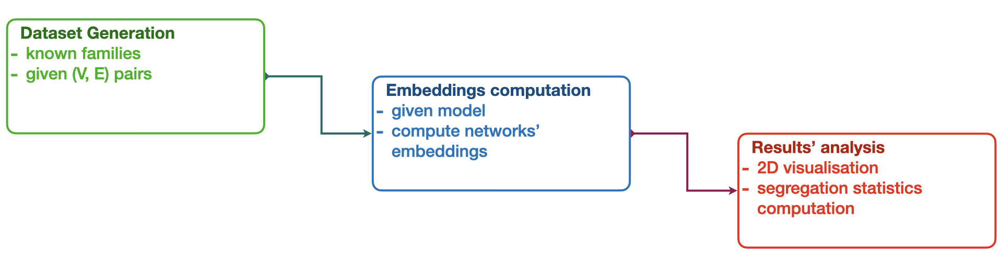

<a class="anchor" id="top"></a>
# 🔭 Space Segregation



<a class="anchor" id="quick_start"></a>
## ⚡️ Quick Start
<p align="right"><a href="#top">🔝</a></p>

TODO:
- [ ] download the dataset
- [ ] download the pre-trained model (or use traditional statistics)
- [ ] run the script
- [ ] links: more details about generation, embedding computation, analysis

> **Note**
> You can directly launch the [companion notebook 🔗](../space_seg.ipynb) for a step-by-step tutorial.


---
<a class="anchor" id="data"></a>
## 💾 Data Generation <br>(`SynNetsGenerator`)
<p align="right"><a href="#top">🔝</a></p>

`SynNetsGenerator` class is constructed around a given dictionnary containing the required informations to generate the networks. It should have the following structure:
```python
gen_dict = {
  <FAMILY_NAME>:{
    <TYPE_NAME>:{
      "generator_path": <path_to_file>,
      "number_generated": <n_graphs>,
    },
    ...
  },
  ...
}
```

This class contains the implementation to generate a dataset of synthetic networks with controlled generative processes. This dataset can then be used to analyse GRL methods capabilities with regard to semantically chosen networks.

A [`SynNetsEmbedder` object](#embed) can be instantiated with the `make_embedder` method, given an embedding method.

<a class="anchor" id="embed"></a>
## 📍 Embeddings Computation <br>(`SynNetsEmbedder`)
<p align="right"><a href="#top">🔝</a></p>

`SynNetsEmbedder` class is used to get graph's representation of the networks produced by the `SynNetsGenerator`. To do so, an embedding method must be provided to the instanciated object.
In practice the representation method from the pre-trained GRL models are given to the class to compute the embeddings of the synthetic networks.

A [`SynEmbAnalyzer` object](#analysis) can be instantiated with the `make_analyzer` method.

<a class="anchor" id="analysis"></a>
## 🩺 Analysis <br>(`SynEmbAnalyzer`)
<p align="right"><a href="#top">🔝</a></p>

Finally, the capabilities of the studied models to segregate their representation space is probed both visually, and through the use of traditional measures from spatial analysis.

<a class="anchor" id="analysis_visu"></a>
### Visualisation
<p align="right"><a href="#analysis">🩺</a></p>

The `visualise` method of `SynEmbAnalyzer` class is implemented to show the distributions of networks from different class in the representation space.

The representations can be projected to 2 dimensions with t-SNE or PCA for instance, and the distributions estimated through KDE or GMMs.

<details><summary>🔮 Output</summary><br/>
<p align="center">
  <picture>
    <source media="(prefers-color-scheme: light)" srcset="../illustrations/space_seg/GrMAE_vGCN_v100_space.gif">
    <source media="(prefers-color-scheme: dark)" srcset="../illustrations/space_seg/GrMAE_vGCN_v100_space.gif">
    
  </picture>
</p>
</details>

<a class="anchor" id="analysis_stats"></a>
### Statistical measures
<p align="right"><a href="#analysis">🩺</a></p>

The assessment is systematised by computed an aggregated coefficient measuring the ability of the model to represent different classes as consistent clusters.

To do so, we measure the silhouette coefficient for each of the generated $(n,m)$ pair.

<p align="center">
  <picture>
    <source media="(prefers-color-scheme: light)" srcset="../illustrations/tsne_kde_degs.png">
    <source media="(prefers-color-scheme: dark)" srcset="../illustrations/tsne_kde_degs_dm.png">
    
  </picture>
</p>
